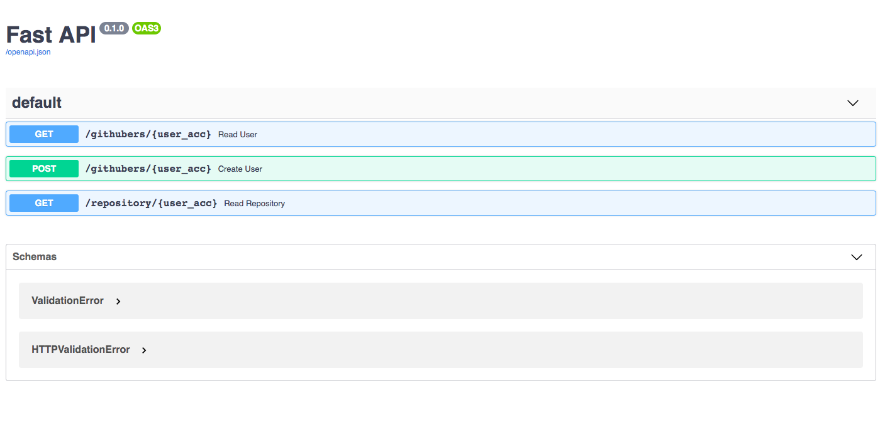
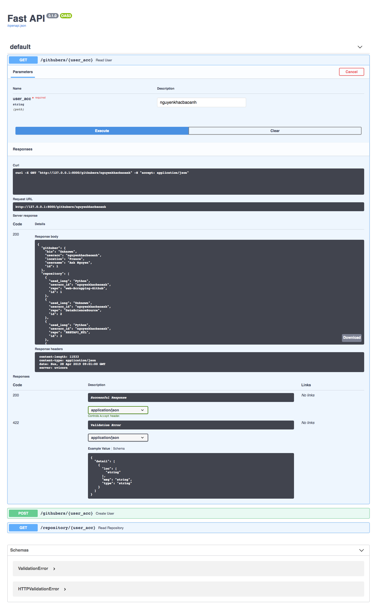

# Github Web scrapping & API

# La structure du programme:
```
/project/
        main.py
        /DataBase/
                __init__.py
                db_scrapping.py
        /ScrappingGithub/
                __init__.py
                scrapping.py
```

- `scrapping.py` scripts dans `ScrappingGithub` module: scrapper les informations d'un compte de github en cherchant des patterns de html du site.
- `db_scrapping.py` scripts dans `DataBase` module: faire en sort de récuperer des informations du module `scrapping.py` et de transformer en bases de données relationelles en utilisant `ORM SqlAlchemy`.
  Sortie du module est le `database.db`.
- `main.py` scripts: permettre d'ouvrir un server qui reçoit le request et le répond ce qui contiennent des methodes `GET` `POST` `UPDATE` `DELETE` (`GET` et `POST` pour l'instant) et même créer des requêtes ou les interfaces d'utisateur sur des routes.

# Tester ce projets:
- Dans terminal:
```bash
git clone
cd web-Scrapping-Github
virtualenv -p python3 scrapping-env
source scrapping-env/bin/activate
pip install -r requirements.txt
```
- créer un fichier `.env` et écrire et sauvegarde.
```
id=your mail github
password = your password
```
- lancer sur terminal
```bash
uvicorn main:app --reload # lancer le server
```

# test:
- crawlling data by POST method
`POST`
```bash
curl -X POST "http://127.0.0.1:8000/githubers/nguyenkhacbaoanh" -H "accept: application/json"
```
- get data by GET Method
`GET`
```bash
curl -X GET "http://127.0.0.1:8000/repository/nguyenkhacbaoanh" -H "accept: application/json"
```
```bash
curl -X GET "http://127.0.0.1:8000/githubers/nguyenkhacbaoanh" -H "accept: application/json"
```

- allez sur navigateur `http://localhost:8000/githubers/nguyenkhacbaoanh` ou `http://localhost:3000/repository/nguyenkhacbaoanh`

# API Documentation:
- FastAPI a généré automatiquement un documentation de API, on peut tester directement sur la docs
- `http://localhost:8000/docs` ou `http://localhost:8000/redocs`
- tout la method de API

- `try it out`


